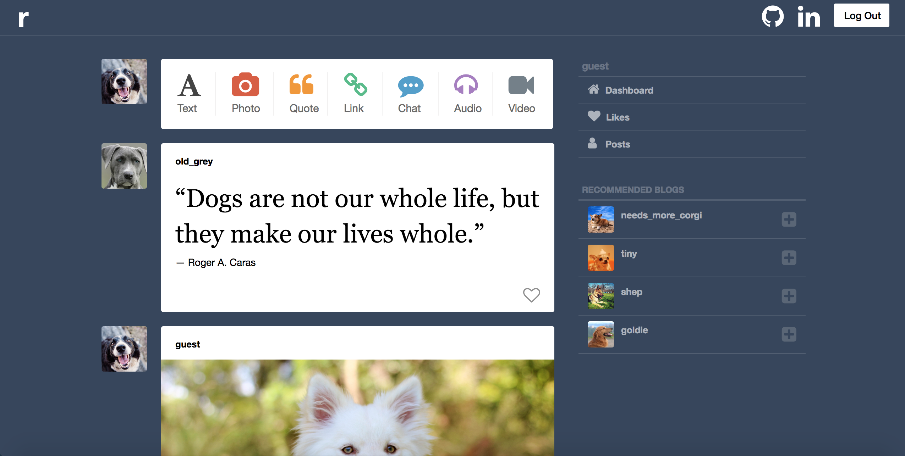
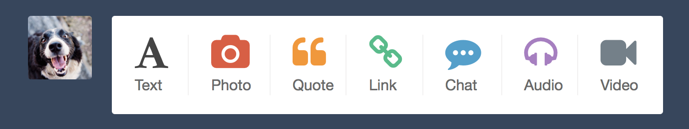
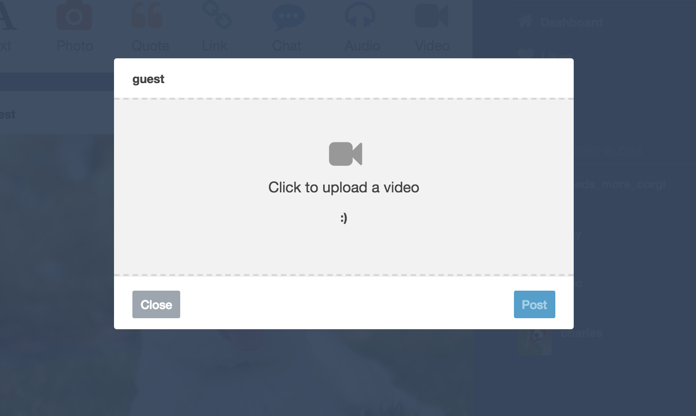
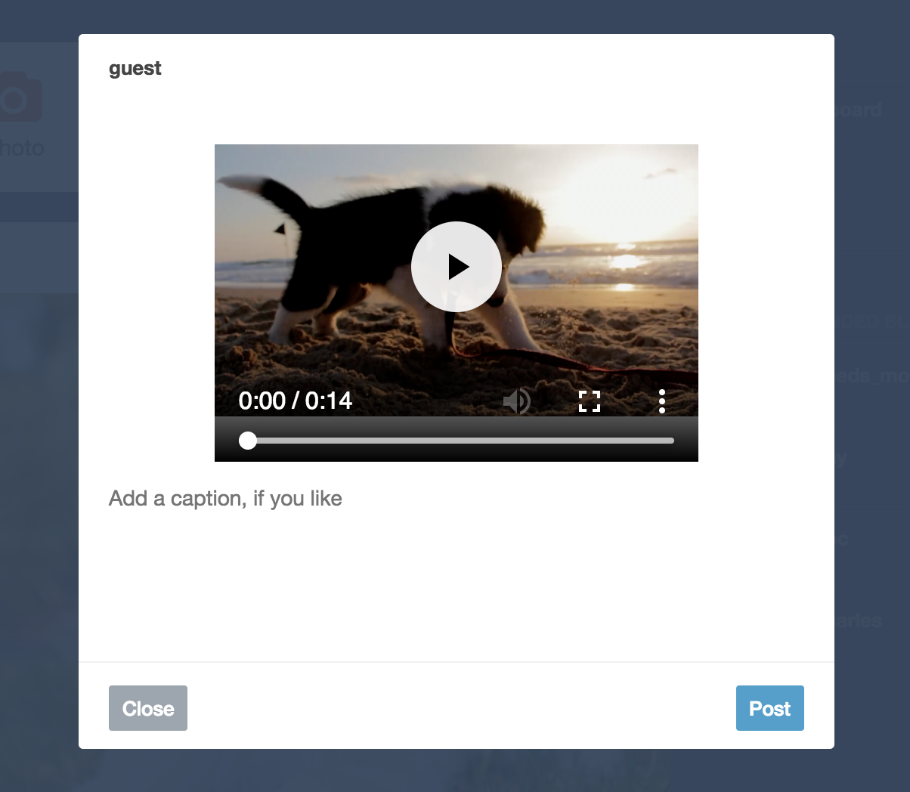
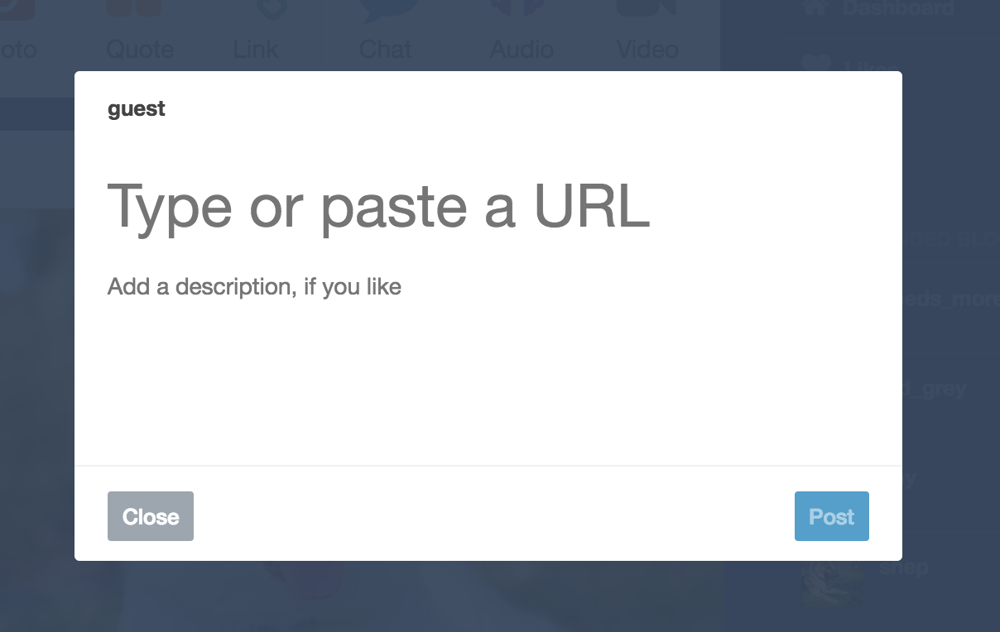
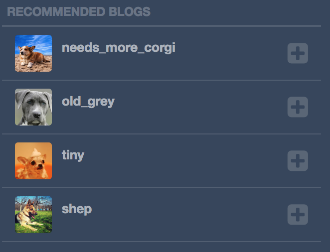
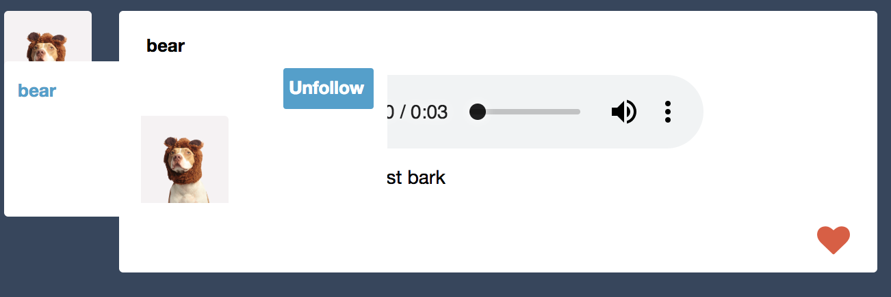
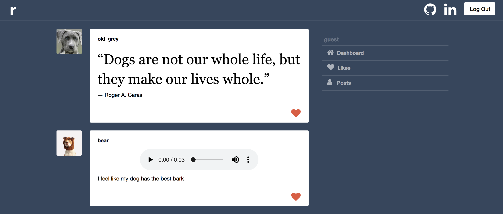
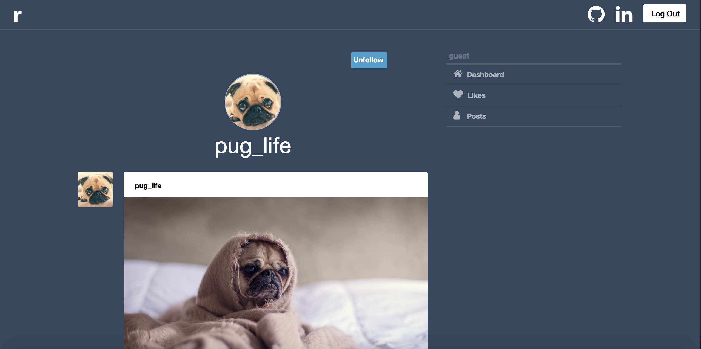

# rollover

[rollover live](https://rollover.herokuapp.com/#/)

rollover is a dog-based blogging site, inspired by tumblr. Users can sign up, make different kinds of posts(including photo, video, and text), find other users to follow, like posts, and see all of their posts on a dashboard.

This project was built in two-weeks with a postgreSQL/Rails 5.2 backend and a React/Redux frontend, with media storage handled by Amazon S3.

## Features

### Post Feed

A user's dashboard contains posts that they've made, as well as posts made by people they are following. It updates when a user follows/unfollows a user or when they make a new post.



Gathering the post data was accomplished by querying the database for posts from the current user and the current user's followed users:

```ruby
def index
  if params[:like]
    liked_posts = current_user.liked_post_ids
    @posts = Post.where(:id => liked_posts)
  else
    followed_ids = current_user.followed_user_ids
    @posts = Post.where(author_id: current_user.id).or(Post.where(:author_id => followed_ids))
  end
end
```

To keep code DRY, posts are all saved in the same table with a postType and are then conditionally rendered with different formats based on what kind of post it is. For example, a photo post renders with an image sourced to the post's photoUrl:

```js
const content = (post.postType === 'photo') ?
<div>
  <div className='media-content'>
  </div>
  <div className='post-text-content'>
    <p className='post-body'>{post.body}</p>
  </div></div> :
```

And a quote post renders with quotes around the title content and a dash before the body:

```js
(post.postType === 'quote') ?
  <div className='post-text-content'>
      <p className='quote-title'>&ldquo;{post.title}&rdquo;</p>
      <p className='post-body'>&mdash;  {post.body}</p>
  </div> :
  ```

### Making Posts

Users can make posts of 7 different types: text, photo, quote, link, chat, audio, and video by clicking on a button in the dashboard:



The buttons open up a form in a modal. There are two different kinds of forms, depending on if the post is text-based or media-based. Each post type has some unique styling for the form, as well.
For the media forms, there is first a styled file input:



And then a preview once a file is selected:



This is accomplished by setting the preview to hidden and then on file submission, loading a preview into the state and getting rid of the hidden status:

```js
onFileChange(field){
  return (e) =>{
    const reader = new FileReader();
    const file = e.target.files[0];

    reader.onloadend = () => {
      this.setState({
        [field]: file,
        preview: reader.result,
        previewState: '',
        inputState: 'hidden'});
    };

    reader.readAsDataURL(file);
  };
}
```

Text-based forms have a title and body section, with changing placeholder text:



All forms have the post button disabled until you either type something in or attach a file. This prevents empty posts from being made while still allowing posts to optionally have either a title, body, or media file.

This is accomplished by checking to see if everything in the state is empty or not:

```js
const postButton = (this.state.body === '' && this.state.title === '') ?
<button className="post"
  disabled>Post</button> :
  <button className='post'>Post</button>;
  ```

### Following Users

There is a sidebar on the dashboard that shows users that the current user isn't following, with an option to follow them.



When a user clicks on the follow button, the dashboard immediately updates to include the new posts and a new unfollowed user is added to the recommended sidebar.

This is accomplished by dispatching several actions at once when hitting follow:

```js
followAction(){
  this.props.followUser(this.props.currentUser.id, this.props.user.id)
    .then(() => this.props.fetchPosts())
      .then(() => this.props.fetchRecommendedFollows(
        this.props.currentUser.id));
}
```

Users can then be unfollowed from a dropdown on the post feed:



### Post Likes

Posts that weren't made by the current user can be liked or unliked from the dashboard by clicking on the heart icon. All of a user's liked posts can be see by clicking 'likes' on the navbar:



### User show pages

Users can click on another user's name anywhere to go to their show page, or on posts in the navbar to see their own show page. These pages show all of the posts made by a user, as well as an option to follow/unfollow them:



The feed will properly fetch new posts, even if moving from show page to show page, by checking it's props to see if a new user has been passed in:

```js
shouldComponentUpdate(nextProps, nextState){
  if (!this.props.user){
    return true;
  }

  if(this.props.userId !== nextProps.userId ||
    this.props.user.followId !== nextProps.user.followId){
    return true;
  } else {
    return false;
  }
}

componentDidUpdate(){
  this.props.fetchUser(this.props.userId)
    .then(() => this.props.fetchPosts(
      this.props.userId, {posts: 'user'}));
}
```

## Project Design

Since there were only two weeks allotted for this project, the focus was to provide users with features that work seamlessly, without bugs. Though tumblr certainly has more capabilities, I wanted to make sure that everything I had worked exactly how it should. That way, new features can be added later without having to worry about issues coming up from previous features.


## Future Features

* Add reblogs
